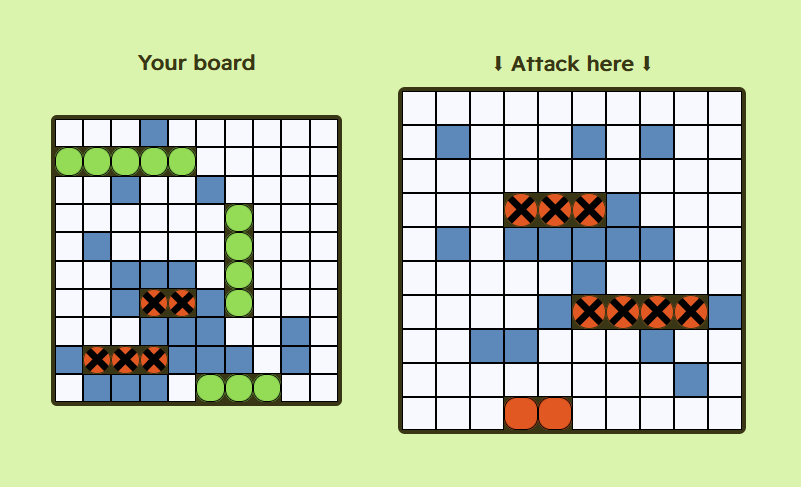

# Battleship (TDD)

This is an implementation of [The Odin Project's plain JS _Battleship_
project](https://www.theodinproject.com/lessons/node-path-javascript-battleship).

The game loop was written using Test Driven Development. Its test suite
comprises 55 tests. As a result, the game is fully functional without a DOM (and
the DOM is decoupled from the internal game).

## Some notable features

- Flexible, intuitive board preparation. Either manual or automatic.
- The game is played against an AI. It's not super smart, but it's definitely
  possible to lose to it if you're unlucky.
- Mobile and desktop friendly
- No production dependencies
- Includes non-intrusive, functional CSS animations

## Known issues

- The ship rotation hotkey doesn't work if a second ship placement button is
  pressed before placing a ship.
